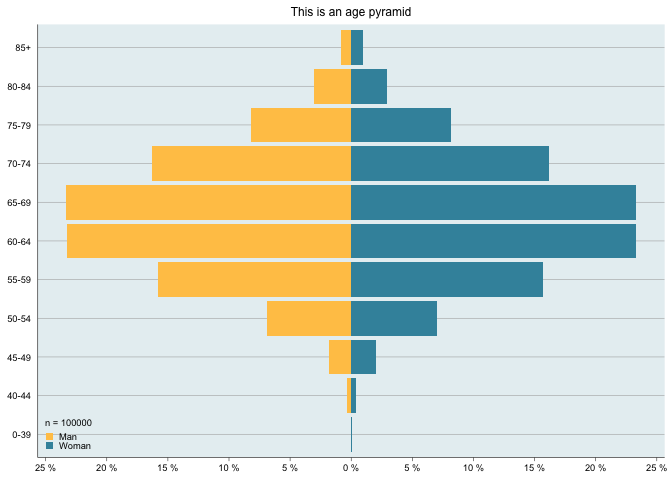
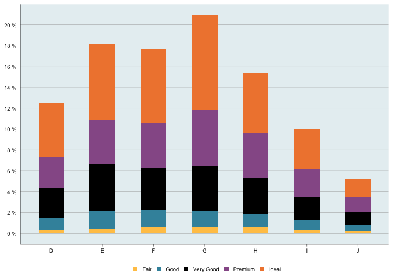
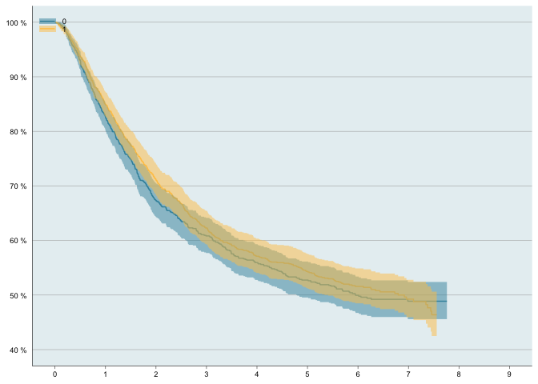
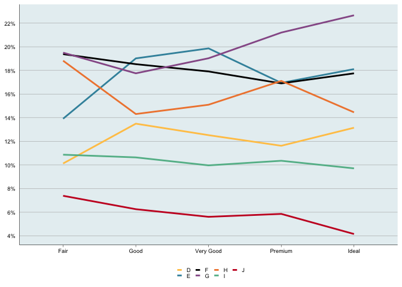

<!-- README.md is generated from README.Rmd. Please edit that file -->

# slrplotfun

<!-- badges: start -->

[](https://github.com/swehip/slrplotfun/actions)
[](https://lifecycle.r-lib.org/articles/stages.html#experimental)
<!-- badges: end -->

The goal of slrplotfun is to implement the design used by the Swedish
Arthroplasty Register with figures produced by ggplot2. Functions are
used for the annual report and more.

## Installation

You can install the development version from
[GitHub](https://github.com/) with:

``` r
# install.packages("devtools")
devtools::install_github("swehip/slrplotfun")
```

## Example

Here are some example plots but please see the individual manual pages
for a comprehensive list.

``` r
library(slrplotfun)
set.seed(123)

# Create some data
df <- data.frame(age = rpois(100000, 65),
  gender = sample(c('Woman', 'Woman', 'Man'), 100000, replace = TRUE))

# Age pyramid
age_pyramid(df, age_var = 'age', gender_var = 'gender',
  man_level = 'Man', title = "This is an age pyramid")
```



``` r
# Bar plot
bar_plot(df = ggplot2::diamonds, x_var = 'color',
fill_var = 'cut', y_breaks = 2)
```



``` r
# KM-plot with 2 levels
survfit_obj <-
  survival::survfit(survival::Surv(time/365.24, status) ~ sex,
  data = survival::colon
)
km_plot(survfit_obj, y_lim = c(40,100), y_breaks = 10, x_lim = c(0,9))
```



``` r
# Line plot
line_plot(df = ggplot2::diamonds, x_var = 'cut', color_var = 'color', y_breaks = 2)
```


